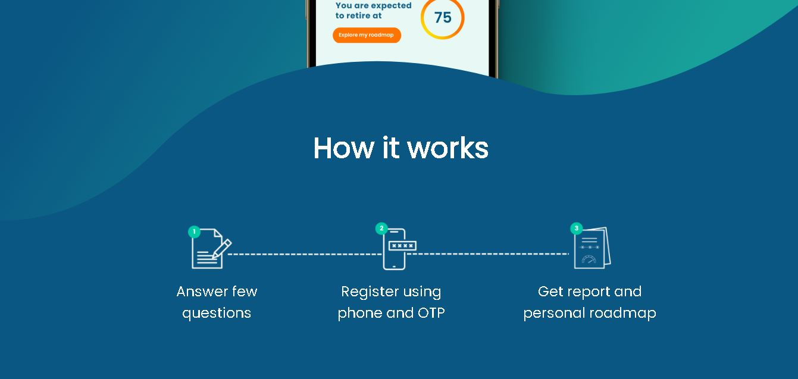

# Frontend-Intern-Assignment-For-Greenmentor

## Screenshots

<div style="display: flex; flex-wrap: wrap; justify-content: space-evenly;">
   
   
</div>


### Installation

1. Clone the repository:

   ```bash
   git clone https://github.com/DevWebAbhi/wealthup_assignment.git

2. Install all required npm modules
    
   npm install

3. Start application by using this command by opening terminal in react app file

   npm run start

4. Deployed Link : https://wealthup-assignment-orcin.vercel.app/
